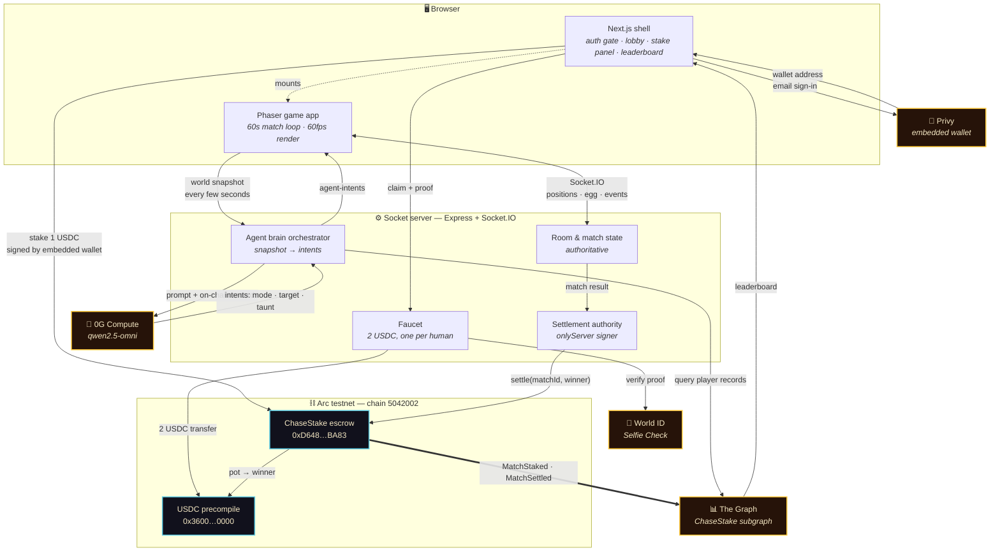
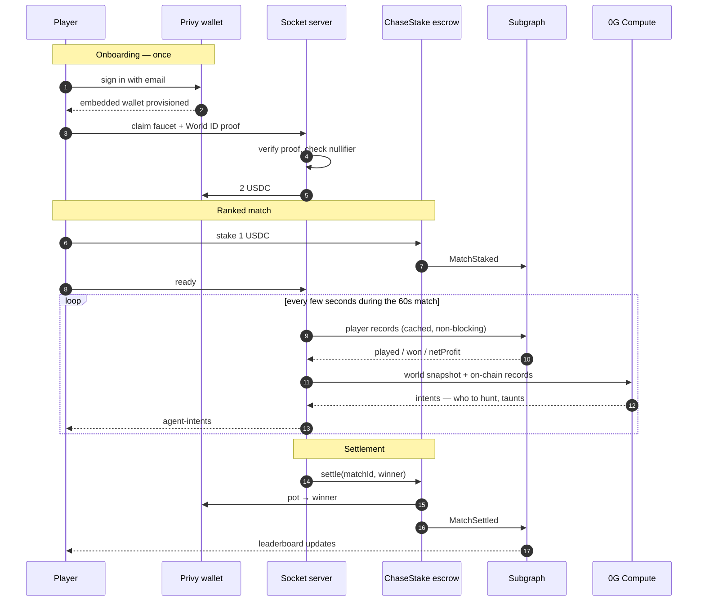

# Architecture — Chase Dinosaurs

Required deliverable for the Arc track ("working frontend and backend plus an architecture
diagram"). Renders natively on GitHub and in the ETHGlobal showcase.

---

## System



**The closed loop is the thick edge.** Settlement writes to the escrow → the escrow's
events are indexed by the subgraph → the subgraph feeds the agent brains → the agents play
differently against proven winners → which changes who wins the next match → which settles
back to the escrow.

---

## Match lifecycle — where the money moves



---

## Why each piece is load-bearing

| Component | Remove it and… |
|---|---|
| **Arc + ChaseStake** | No stakes. The game still runs, but nothing is at risk and nothing pays out. |
| **Privy** | No wallet without an extension and a seed phrase. Onboarding drops to near zero. |
| **World ID** | The faucet is keyed on email — ten inboxes, twenty USDC. |
| **The Graph** | Agents lose their threat model and fall back to pure geometry. Measurably dumber. |
| **0G Compute** | Agents fall back to scripted steering; no strategy, no taunts. |

---

## Runtime notes for reviewers

**Three processes in development:**

```bash
npm run dev          # Next shell        → :3000
npm run dev:game     # Phaser game app   → :5173
npm run socket:dev   # Socket + chain    → :3001
```

**Production is one command** — `npm run build:all`. Plain `npm run build` leaves
`public/game-app/` empty and the Play button 404s.

**Arc specifics worth knowing:**

- Chain id **5042002**, RPC `https://rpc.testnet.arc.network`, explorer
  `https://testnet.arcscan.app`
- The USDC precompile at `0x3600…0000` is a **6-decimal view over the 18-decimal native
  balance** (`native / 1e12 == balanceOf`). One native transfer funds gas *and* the stake —
  which is why the faucet sends a single transaction and the player never needs a second
  token.
- Settlement is `onlyServer`; `refund()` opens after `REFUND_DELAY = 1 hour` so a match
  that never settles is always recoverable by the players.

**Trust boundaries** — everything that matters is server-side or on-chain:

- World ID proofs are verified against World's Developer Portal by the server. A browser
  asserting `verified: true` is worth nothing.
- The settlement key never reaches the client; `settle()` reverts for any other caller.
- The subgraph endpoint is public and unauthenticated **by design** — anyone can run the
  same query and reproduce the leaderboard without trusting us.
